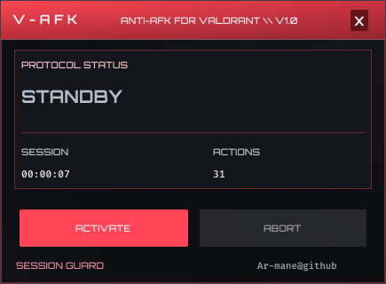
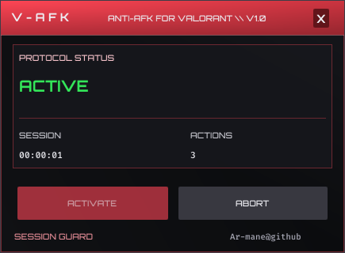

# V-AFK

V-AFK is a Windows desktop utility with a Valorant-style interface that simulates light, human-like input activity to reduce AFK disconnects.

## Screenshots

<p align="center">
  
  
</p>

## What This Repo Contains

- A Windows app with a clean Valorant-style interface.
- Smart anti-AFK behavior with natural activity patterns.
- Ready-to-download releases with verification details.

## Quick Start

Requirements:

- Windows
- Visual Studio Build Tools (or Visual Studio with C++ workload)
- CMake
- make available in your shell

Build and run:

```bash
make configure
make build
make run
```

## Releases

For each GitHub Release, this project is set up to provide:

- Windows executable artifact.
- SHA256 checksum for integrity verification.
- VirusTotal links in release notes when available.

Recommended download flow:

1. Download V-AFK.exe from the latest Release.
2. Compare the file SHA256 with the checksum listed in release notes.
3. Review VirusTotal links from the same release notes.
4. Run only if verification results are acceptable to you.

Note: Windows SmartScreen warnings can appear for unsigned binaries.

## Contributing

Contributions are welcome: bug fixes, UX polish, architecture cleanup, and CI improvements.

